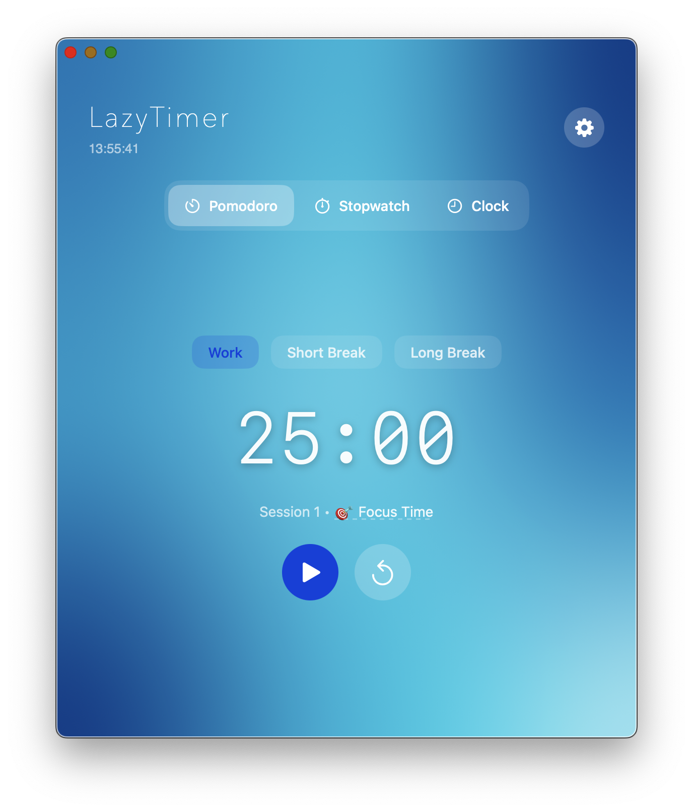

# LazyTimer
**Focus beautifully.**

  

LazyTimer is strictly just a timer. Just you and your work.

## Better Ways to Focus

### A View for Every Mood
- **Standard**: Just a timer.
- **Floating**: A tiny timer that stays on top of your windows.
- **Overlay**: Go full-screen without blocking the view of your work.

  

### Privacy First
- **Offline Forever**: Doesn't need the internet.
- **Zero Tracking**: What you work on is your business.

## Requirements & Build
- **macOS 15.2+** (Sequoia) required. built for the future.
- **Xcode 16+** needed to build from source.

### How to Run
1. Clone the repo: `git clone https://github.com/gajzzs/LazyTimer.git`
2. Open `LazyTimer.xcodeproj` in Xcode.
3. Hit **Cmd+R** to build and run.

## Coming Soon
Things I'm tinkering with:
- **Soundscapes**: Lofi beats or white noise to help you lock in.
- **Motion**: Video backgrounds for a deeper vibe.
- **Zen Mode**: Hiding everything but the numbers when you go full-screen.

---

  <b>Handcrafted with ❤️ & Simplicity.</b>

